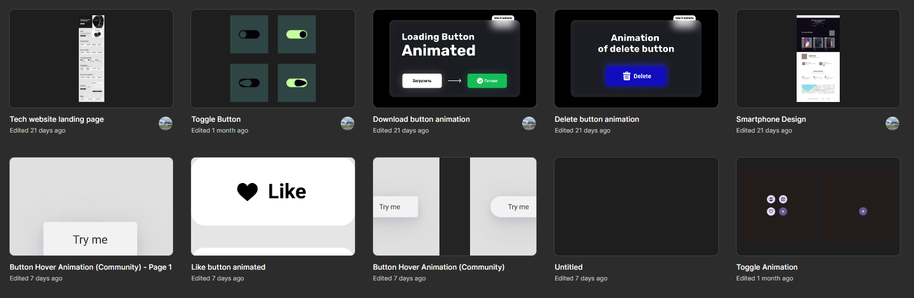

# 🎨 Figma Designs by Kerem Semiz

This repository contains various UI/UX designs created using **Figma**. These designs showcase different concepts, prototypes, and layouts for a variety of projects.

## 📂 Available Figma Designs

Below are links to the Figma design files:

1. [Delete Button Animation](https://www.figma.com/design/ordwWtGHj510jhoSgJU69N/Delete-button-animation?node-id=0-1&t=QfOuZVapOlTjHaJk-1)
2. [Download Button Animation](https://www.figma.com/design/hID0wGUqJS2bnn91N2i8bi/Download-button-animation?node-id=0-1&t=0JKl7r1RoccAlic2-1)
3. [Button Hover Animation](https://www.figma.com/design/9ZPxDcASdWYMQM3BeVVzde/Button-Hover-Animation?node-id=45-4&t=MLsYsDftypjY5Sn5-1)
4. [Like Button Animation](https://www.figma.com/design/vlmUb1jHjrl4gJamdYauQL/Like-button-animated?node-id=0-1&t=KBzqCxpOZJ67T3Ep-1)
5. [Toggle Animation](https://www.figma.com/design/8b7Tasn5CE9LUp0EiO63CO/Toggle-Animation?node-id=0-1&t=CsE6PhCsaLN69arC-1)
6. [Toggle Button](https://www.figma.com/design/BHnwHM6d2nMFqQ3Cfr9lFh/Toggle-Button?node-id=0-1&t=AKMnBt509BSUlKsi-1)
7. [Smartphone Website](https://www.figma.com/design/ItYIdMQKzGqzPQSrMnc6t9/Smartphone-Design?node-id=0-1&t=I1HZCDzVfiBrAY3T-1)
8. [Tech Watch Website](https://www.figma.com/design/4ON5IpNUUKPKjEwBmH2pYI/Tech-website-landing-page?node-id=0-1&t=4IweYwZifCaxL4LP-1)

## 🛠️ Tools & Technologies

- **Figma**: All designs are created using Figma, a web-based UI/UX design tool. You can view and interact with the prototypes directly via the provided links.

## 📋 How to Use

1. **View the Designs**: Simply click on the links above to view each design in Figma.
2. **Prototype Interaction**: Some designs may include interactive prototypes. Use the play button in Figma to explore them.
3. **Feedback**: Feel free to provide feedback through GitHub issues if you have any suggestions or improvements.

---

[GitHub Repository](https://github.com/keremsemiz/figma-designs)
